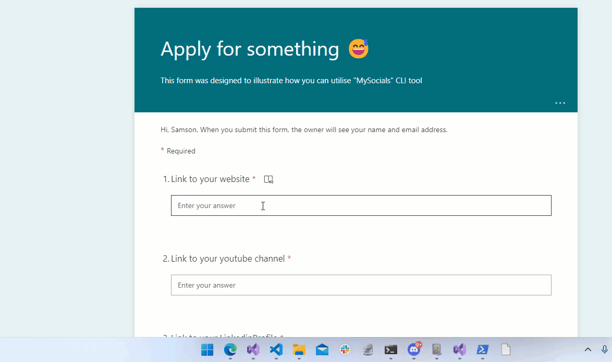

### MySocials

  MySocials CLI tool is made by Samson Amaugo @https://github.com/sammychinedu2ky
       
A handy tool to store and easily retrieve (to clipboard) some of your important social links or details
eg: Github profile link, youtube channel link, or any text data of your choice
- Data is stored locally on your machine
     
    ```
    run-time options:
    Select          Displays a list of stored data which you select from and store in the clipboard

    Add             Store a text data by insert its key and value

    Update          Update an already stored data by selecting its key

    Delete          Delete an already stored data by selecting its key

    [*anyword]      Stores in the clipboard if data is available

    Help            Prints out help details

    ```

- Executing the code without any option would copy all the available data into your clipboard.

#### **How to Use :**

*   You should have Powershell v7+ and DotNet SDK installed on your computer
*   To install using DotNet CLI execute the command below:
*   `dotnet tool install --global MySocials --version 1.1.0`
*   To set up, execute : `mysocials`  
    \-- This would create the JSON file that would be used to store the local data  
    \-- If the file already exists it would copy all the details in it to your clipboard
*   To add details, execute : `mysocials add`  
    \-- This would wait for you to input values using key-value pairs  
    \-- You can input as much data(key-value pairs) as you want
*   To select data, execute : `mysocials select`  
    \-- This would print out an interactive list of available data which you can navigate through using your arrow key  
    \-- To select data, use your enter-key  
    \-- The selected data would be saved into your clipboard which would make it easy for you to paste
*   To update data, execute: `mysocials update`  
    \-- This would print out an interactive list of available data which you can navigate through using your arrow key  
    \-- To select the data to update, use the enter key  
    \-- Input the new data for the desired key  
    \-- Press the enter key to save the value
*   To delete data, execute: `mysocials delete`  
    \-- This would print out an interactive list of available data which you can navigate through using your arrow key  
    \-- Select the data to delete using the enter key
*   To select a specific data, execute: `mysocials [*anyword]`  
    \-- This would save the \[\*anyword\] value to the clipboard if it exists
  
  
Below is an illustration showing how to use the CLI tool once installed. 




 Also feel free to contribute to it and use as you like.